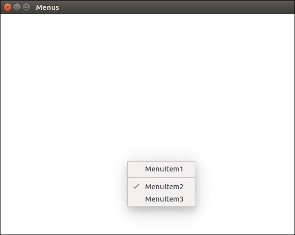

# Electron file handling, Node libraries, Menu and System Tray, Webview and Notifications

## Learning Competencies
By this end of this tutorial, you will be able to know about

- what is file handling
- interact with files in desktop application
- create form in your application
- Native node libraries
- create Menus and System trays in your application
- add notifications to the application using npm module
- add web pages in your Electron app using webview container

## Overview

## File handling

File handling is a very important part of building a desktop application. Almost all desktop apps interact with files.

We will create a form in our app that'll take as input a Name and Email address. We'll save this to a file and create a list that'll show this as output.

Set up your main process using the following code in the main.js file:

```js
const {app, BrowserWindow} = require('electron')
const url = require('url')
const path = require('path')

let win

function createWindow() {
   win = new BrowserWindow({width: 800, height: 600})
   win.loadURL(url.format({
      pathname: path.join(__dirname, 'index.html'),
      protocol: 'file:',
      slashes: true
   }))
}

app.on('ready', createWindow)
```

Now open the `index.html` file and enter the following code in it:

```html
<!DOCTYPE html>
<html>
   <head>
      <meta charset="UTF-8">
      <title>File System</title>
      <link rel="stylesheet" href="./bower_components/bootstrap/dist/css/bootstrap.min.css" />
      <style type="text/css">
         #contact-list{
            height: 150px;
            overflow-y: auto;
         }
      </style>
   </head>
   <body>
      <div class="container">
         <h1>Enter Names and Email addresses of your contacts</h1>
         <div class="form-group">
            <label for="Name">Name</label><input type="text" name="Name" value="" id="Name" placeholder="Name" class="form-control" required>
         </div>
         <div class="form-group">
            <label for="Email">Email</label><input type="email" name="Email" value="" id="Email" placeholder="Email" class="form-control" required>
         </div>
         <div class="form-group">
            <button class="btn btn-primary" id="add-to-list">Add to list!</button>
         </div>
         <div id="contact-list">
            <table class="table-striped" id="contact-table">
               <tr>
                  <th class="col-xs-2">S. No.</th>
                  <th class="col-xs-4">Name</th>
                  <th class="col-xs-6">Email</th>
               </tr>
            </table>
         </div>
         <script src="./view.js" ></script>
      </div>
   </body>
</html>
```

Now we need to handle the addition event. We'll do this in our view.js file. We will create a function `loadAndDisplayContacts()` that will initially load contacts from the file. Then we'll create a click handler on our add to list button. This will add the entry to both the file and the table.

In your view.js file, enter the following code:

```js
let $ = require('jquery')
let fs = require('fs')
let filename = 'contacts'
let sno = 0

$('#add-to-list').on('click', () => {
   let name = $('#Name').val()
   let email = $('#Email').val()

   fs.appendFile('contacts', name + ',' + email + '\n')

   addEntry(name, email)
})

function addEntry(name, email) {
   if(name && email){
      sno++
      let updateString = ''+ sno + ''+ name +'' + email +''
      $('#contact-table').append(updateString)
   }
}

function loadAndDisplayContacts(){
   //Check if file exists
   if(fs.existsSync(filename)){
      let data = fs.readFileSync(filename, 'utf8').split('\n')
      data.forEach((contact, index) => {
         let [ name, email ] = contact.split(',')
         addEntry(name, email)
      })
   }
   else {
      console.log("File Doesn\'t Exist. Creating new file.")
      fs.writeFile(filename, '', (err) => {
         if(err)
            console.log(err)
      })
   }
}

loadAndDisplayContacts()
```

Now run the application using:

```
$ electron ./main.js
```

Once you add some contacts to it, the application will look like:


For more fs module API calls, please refer to [Node File System](https://www.tutorialspoint.com/nodejs/nodejs_file_system.htm) topic.

## Native Node libraries   

### OS module

Using the os module, we can get a lot of information about the system our application is running on. Following are some of the methods that are quite useful when creating apps, such that we can customize them according to the OS that they are running on.

|Function              | Description|
|----------------------|------------|
|os.userInfo([options])| The os.userInfo() method returns information about the currently effective user. This information could be used to personalize the application for the user even without explicitly asking for information.|
|os.platform()         | The os.platform() method returns a string identifying the operating system platform. This can be used to customize the app according to the user OS.|
|os.homedir()          | The os.homedir() method returns the home directory of the current user as a string. Generally configs of all users reside in the home directory of the user. So this can be used for the same purpose for our app.|
|os.arch()             | The os.arch() method returns a string identifying the operating system CPU architecture. This can be used when running on exotic architectures to adapt your application for that system.|
|os.EOL                | A string constant defining the operating system-specific end-of-line marker. This should be used whenever ending lines in files on the host OS.|

Using the same main.js file and the following HTML file, we can print these properties on the screen:

```html
<html>
   <head>
      <title>OS Module</title>
   </head>
   <body>
      <script>
         let os = require('os')
         document.write('User Info: ' + JSON.stringify(os.userInfo()) + '<br>' +
            'Platform: ' + os.platform() + '<br>' +
            'User home directory: ' +  os.homedir() + '<br>' +
            'OS Architecture: ' + os.arch() + '<br>')
      </script>
   </body>
</html>
```

Now run the app using:

```
$ electron ./main.js
```

You should get the output like:

```
User Info: {"uid":1000,"gid":1000,"username":"ayushgp","homedir":"/home/ayushgp","shell":"/usr/bin/zsh"}
Platform: linux
User home directory: /home/ayushgp
OS Architecture: x64
```

### Net Module

The net module is used for network related work in the app. We can create both servers and socket connections using this module. You'll not generally need this module as it is quite low level. Mostly you'll be using a wrapper module from npm for networking related tasks.

Some of the most useful methods from the module are listed here:


|Function                                          |  Description|
|--------------------------------------------------|-------------|
|net.createServer([options][, connectionListener]) |  Creates a new TCP server. The connectionListener argument is automatically set as a listener for the 'connection' event.|
|net.createConnection(options[, connectionListener])| A factory method, which returns a new 'net.Socket' and connects to the supplied address and port.|
|net.Server.listen(port[, host][, backlog][, callback]) |   Begin accepting connections on the specified port and host. If the host is omitted, the server will accept connections directed to any IPv4 address.|
|net.Server.close([callback]) |  Finally closed when all connections are ended and the server emits a 'close' event.|
|net.Socket.connect(port[, host][, connectListener])| Opens the connection for a given socket. If port and host are given, then the socket will be opened as a TCP socket.|

Creating an electron app that uses net module to create connections to the server. We'll need to create a new file, server.js:

```js
var net = require('net');
var server = net.createServer(function(connection) {
   console.log('Client Connected');

   connection.on('end', function() {
      console.log('client disconnected');
   });
   connection.write('Hello World!\r\n');
   connection.pipe(connection);
});


server.listen(8080, function() {
   console.log('Server running on http://localhost:8080');
});
```

Using the same main.js file, replace the HTML file with the following:

```html
<html>
   <head>
      <title>net Module</title>
   </head>
   <body>
      <script>
         var net = require('net');
         var client = net.connect({port: 8080}, function() {
            console.log('Connection established!');
         });
         client.on('data', function(data) {
            document.write(data.toString());
            client.end();
         });
         client.on('end', function() {
            console.log('Disconnected :(');
         });
      </script>
   </body>
</html>
```

Run the server using:

```
$ node server.js
```

Run the application using:

```
$ electron ./main.js
```

You should get the output: `Hello world!` in your application

Check the console that we connected to the server automatically and were automatically disconnected.

## Menu

On desktop apps we generally have 2 types of menus, the application menu(on the top bar) and a context menu(right click menu). 

We'll be using 2 modules namely Menu and MenuItem. Note that Menu and MenuItem modules are only available in the main process.
For using them in the renderer process you need another module remote.

Lets create a new main.js file for the main process:

```js
const {app, BrowserWindow, Menu, MenuItem} = require('electron')
const url = require('url')
const path = require('path')

let win

function createWindow() {
   win = new BrowserWindow({width: 800, height: 600})
   win.loadURL(url.format({
      pathname: path.join(__dirname, 'index.html'),
      protocol: 'file:',
      slashes: true
   }))
}

const template = [
   {
      label: 'Edit',
      submenu: [
         {
            role: 'undo'
         },
         {
            role: 'redo'
         },
         {
            type: 'separator'
         },
         {
            role: 'cut'
         },
         {
            role: 'copy'
         },
         {
            role: 'paste'
         }
      ]
   },
   {
      label: 'View',
      submenu: [
         {
            role: 'reload'
         },
         {
            role: 'toggledevtools'
         },
         {
            type: 'separator'
         },
         {
            role: 'resetzoom'
         },
         {
            role: 'zoomin'
         },
         {
            role: 'zoomout'
         },
         {
            type: 'separator'
         },
         {
            role: 'togglefullscreen'
         }
      ]
   },
   {
      role: 'window',
      submenu: [
         {
            role: 'minimize'
         },
         {
            role: 'close'
         }
      ]
   },
   {
      role: 'help',
      submenu: [
         {
            label: 'Learn More'
         }
      ]
   }
]

const menu = Menu.buildFromTemplate(template)
Menu.setApplicationMenu(menu)
```

We're building a menu from a template here. This means that we provide the menu as a JSON to the function and it'll take care of the rest. Now we have to set this menu as the Application menu.

Now create an empty HTML file called index.html and run this application using:

```
$ electron ./main.js
```

On the normal position of application menus you'll now see a menu based on above template.


We created this menu from the main process. Now lets create a context menu for our app. We'll do this in our HTML file:

```html
<!DOCTYPE html>
<html>
   <head>
      <meta charset="UTF-8">
      <title>Menus</title>
   </head>
   <body>
      <script type="text/javascript">
         const {remote} = require('electron')
         const {Menu, MenuItem} = remote

         const menu = new Menu()

         // Build menu one item at a time, unlike
         menu.append(new MenuItem({
            label: 'MenuItem1',
            click() {
               console.log('item 1 clicked')
            }
         }))
         menu.append(new MenuItem({type: 'separator'}))
         menu.append(new MenuItem({label: 'MenuItem2', type: 'checkbox', checked: true}))
         menu.append(new MenuItem({
            label: 'MenuItem3',
            click() {
               console.log('item 3 clicked')
            }
         }))

         // Prevent default action of right click in chromium. Replace with our menu.
         window.addEventListener('contextmenu', (e) => {
            e.preventDefault()
            menu.popup(remote.getCurrentWindow())
         }, false)
      </script>
   </body>
</html>
```

We imported the Menu and MenuItem modules using the remote module. Then we created a menu and appended our `menuitems` to 
one by one. Then we prevented the default action of right click in chromium and replaced it with our menu.



You can attach your event handlers to these items and handle the events according to your needs.

## System tray

System tray is a menu outside of your application window. On MacOS and Ubuntu it is located on the top right corner of your
screen. On Windows it is on the bottom right corner. We can create menus for our application in system trays using Electron.

Create a new main.js file and ad the following code to it. Have a png file ready to use for the system tray icon.

```js
const {app, BrowserWindow} = require('electron')
const url = require('url')
const path = require('path')

let win

function createWindow() {
   win = new BrowserWindow({width: 800, height: 600})
   win.loadURL(url.format({
      pathname: path.join(__dirname, 'index.html'),
      protocol: 'file:',
      slashes: true
   }))
}

app.on('ready', createWindow)
```

Now we have set up a basic browser window, create a new index.html file with the following contents:

```html
<!DOCTYPE html>
<html>
   <head>
      <meta charset="UTF-8">
      <title>Menus</title>
   </head>
   <body>
      <script type="text/javascript">
         const {remote} = require('electron')
         const {Tray, Menu} = remote
         const path = require('path')

         let trayIcon = new Tray(path.join('','/home/ayushgp/Desktop/images.png'))

         const trayMenuTemplate = [
            {
               label: 'Empty Application',
               enabled: false
            },
            {
               label: 'Settings',
               click: function () {
                  console.log("Clicked on settings")
               }
            },
            {
               label: 'Help',
               click: function () {
                  console.log("Clicked on Help")
               }
            }
         ]
         let trayMenu = Menu.buildFromTemplate(trayMenuTemplate)
         trayIcon.setContextMenu(trayMenu)
      </script>
   </body>
</html>
```

We created the tray using the Tray submodule. We then created a menu using a template and then attached the meny to our tray object.

Run the application using:

```
$ electron ./main.js
```

When you run it, check your system tray for the icon you used. You can see the output
here:


## Notification 

Electron provides native notifications API only for MacOS. So we are not going to use that, instead we'll be using a npm module called node-notifier. It allows us to notify users on Windows, MacOS and Linux.

Install the `node-notifier` module in your app folder using the following command in that folder:

```
$ npm install --save node-notifier
```

Now let's create an app that has a button that'll generate a notification every time we click on this button.

Create a new main.js file and enter the following code in it:

```js
const {app, BrowserWindow} = require('electron')
const url = require('url')
const path = require('path')

let win

function createWindow() {
   win = new BrowserWindow({width: 800, height: 600})
   win.loadURL(url.format({
      pathname: path.join(__dirname, 'index.html'),
      protocol: 'file:',
      slashes: true
   }))
}

app.on('ready', createWindow)
```

Now lets create our webpage and script that'll trigger the notification. Create a new index.html file with the following code:

```html
<!DOCTYPE html>
<html>
   <head>
      <meta charset="UTF-8">
      <title>Menus</title>
   </head>
   <body>
      <button type="button" id="notify" name="button">Click here to trigger a notification!</button>
      <script type="text/javascript">
         const notifier = require('node-notifier')
         const path = require('path');
         document.getElementById('notify').onclick = (event) => {
            notifier.notify({
               title: 'My awesome title',
               message: 'Hello from electron, Mr. User!',
               icon: path.join('','/home/ayushgp/Desktop/images.png'), // Absolute path (doesn't work on balloons)
               sound: true, // Only Notification Center or Windows Toasters
               wait: true // Wait with callback, until user action is taken against notification
            }, function (err, response) {
               // Response is response from notification
            });

            notifier.on('click', function (notifierObject, options) {
               console.log("You clicked on the notification")
            });

            notifier.on('timeout', function (notifierObject, options) {
               console.log("Notification timed out!")
            });
         }
      </script>
   </body>
</html>
```

The notify method allows us to pass it an objectwith information like the title, message, thumbnail, etc which help us customize the notification. We can also set some event listeners on the notification.

Now when you run this app using:

```
$ electron ./main.js
```

When you click on the button that we created, you'll see a native notification from your operating system which will look
something like:


We have also handled the events in case the user clicks the notification or the notification times out. These methods help us
make the app more interactive if its running in the background.

## Web View

The webview tag is used to embed 'guest' content like web pages in your Electron app. This content is contained within the webview container. An embedded page within your app controls how this content will be displayed.

The webview runs in a separate process than your app. To ensure security from malicious content, the webview doesn't have same permissions as your web page. This keeps your app safe from the embedded content. All interactions between your app and embedded page will be asynchronous.

Lets see an example of embedding an external webpage in pur electron app. We will embed the facebook website in our app on the right side. Create a new main.js file with the following content:

```js
const {app, BrowserWindow} = require('electron')
const url = require('url')
const path = require('path')

let win

function createWindow() {
   win = new BrowserWindow({width: 800, height: 600})
   win.loadURL(url.format({
      pathname: path.join(__dirname, 'index.html'),
      protocol: 'file:',
      slashes: true
   }))
}

app.on('ready', createWindow)
```

Now that we've setup our main process, lets create the HTML file that'll embed the facebook website. Create a file called index.html with the following content:

```html
<!DOCTYPE html>
<html>
   <head>
      <meta charset="UTF-8">
      <title>Menus</title>
   </head>
   <body>
      <div>
         <div>
            <h2>We have the website embedded below!</h2>
         </div>
         <webview id="foo" src="http://soal.io" style="width:400px; height:480px;">
            <div class="indicator"></div>
         </webview>
      </div>
      <script type="text/javascript">
      // Event handlers for loading events.
      // Use these to handle loading screens, transitions, etc
      onload = () => {
         const webview = document.getElementById('foo')
         const indicator = document.querySelector('.indicator')

         const loadstart = () => {
            indicator.innerText = 'loading...'
         }

         const loadstop = () => {
            indicator.innerText = ''
         }

         webview.addEventListener('did-start-loading', loadstart)
         webview.addEventListener('did-stop-loading', loadstop)
      }
      </script>
   </body>
</html>
```

Run the app using:

```
$ electron ./main.js
```

You should get the output:


The webview tag can be used for other resources as well. The webview element has a list of event that it emits listed on the official docs. You can use these events to improve functionality depending on the things that take place in the webview.

Whenever you're embedding scripts or other resources from the internet, it is advisable to use webview. Doing so has great security benefits without hindering any normal behaviour.

## Exploration

- Learn more about electron from official [doc](https://electronjs.org/docs)
- Electron tutorial [application](https://github.com/crilleengvall/electron-tutorial-app)
- watch [this](https://www.youtube.com/playlist?list=PLYxzS__5yYQmocPoLUiEAfD1cJNjhdQar) electron video tutorial